# System Architecture & Design Diagrams

These diagrams illustrate the core architectural decisions for the Retro Pong project. They must be consulted when implementing networking, state management, or UI layers to ensure consistency.

## 1. High-Level Container View
Shows the relationship between the Phaser Client, Colyseus Server, and Firebase persistence layer.

```mermaid
graph TD
    subgraph Client_Side ["📱 Client Side (Browser/Mobile)"]
        Player["👤 Player"]
        PhaserApp["🎮 Phaser 3 Application<br/>(Rendering, Input, Audio)"]
    end

    subgraph Server_Side ["☁️ Backend Infrastructure"]
        GameServer["🖥️ Node.js Game Server<br/>(Colyseus Authoritative Physics)"]
        DB[("🗄️ Firebase Firestore v9<br/>(Leaderboards/Persistence)")]
    end

    %% Connections
    Player -->|Touch Input| PhaserApp
    PhaserApp -->|Visuals & Audio| Player

    PhaserApp <-->|"⚡ WebSockets (Real-time State/Input)"| GameServer
    GameServer <-->|"🔒 HTTPS (REST/SDK)"| DB

    style Client_Side fill:#f0f4ff,stroke:#0000ff,stroke-width:2px,color:#000
    style Server_Side fill:#fff4f0,stroke:#ff5722,stroke-width:2px,color:#000
    style PhaserApp fill:#c7d2fe,stroke:#3730a3,color:#000
    style GameServer fill:#ffccbc,stroke:#bf360c,color:#000
    style DB fill:#fff9c4,stroke:#f57f17,color:#000
```



## 2. Authoritative Game Loop (Sequence)
Illustrates the "Client-Side Prediction + Server Reconciliation" pattern used to mask latency.

```mermaid
sequenceDiagram
    autonumber
    participant P as 👤 Player
    participant C as 📱 Client (Phaser)
    participant S as ☁️ Server (Colyseus)

    note over P, S: Gameplay Session Started

    P->>C: Tap Screen (e.g., "Move Up")
    
    rect rgb(240, 248, 255)
        note right of C: ⚡ LOCAL PREDICTION
        C->>C: Immediately move local paddle Y position
    end
    
    C->>S: Send Input Message { intent: "UP" } (via WS)

    rect rgb(255, 245, 235)
        note left of S: 🧠 AUTHORITATIVE SIMULATION (60Hz Tick)
        S->>S: Receive Input
        S->>S: Validate Input (Is move allowed?)
        S->>S: Run Physics Step (Move paddles, update ball pos)
        S->>S: Detect Collisions (Ball hits wall/paddle)
        S->>S: Update Colyseus State Schema
    end

    S-->>C: Broadcast State Delta Patch (via WS)

    rect rgb(240, 248, 255)
        note right of C: 🔄 RECONCILIATION
        C->>C: Receive Server State
        C->>C: Compare Server Paddle Y vs Local Paddle Y
        C->>C: Correct Local position if deviation > threshold
        C->>C: Interpolate (smooth) remote player paddle/ball positions
    end

    C->>P: Render Updated Frame
```



## 3. Server State Schema (Class Data)
Defines the strict data structure synchronized by Colyseus.


## 4. Mobile-First Input Layer Stack
Shows how invisible UI layers capture touch events over the rendering canvas.

```mermaid
graph TD
    subgraph Device_Screen ["📱 Mobile Device Screen (Landscape View)"]
      style Device_Screen fill:#1b2853,stroke:#04c4ca,stroke-width:3px
        
        subgraph Visual_Layers ["🎨 Visual Rendering Layers"]
            Canvas["Phaser WebGL Canvas<br/>(Game world, Paddles, Ball)"]
            CRTOverlay["CSS Overlay: CRT Scanlines & Vignette<br/>(pointer-events: none)"]
        end

        subgraph Input_Layers ["👆 Invisible Touch Input Layers"]
            style Input_Layers fill:transparent,stroke:none
            
            LeftTap["INVISIBLE LEFT ZONE<br/>(Tap = Move Up)<br/>Width: 50%"]
            RightTap["INVISIBLE RIGHT ZONE<br/>(Tap = Move Down)<br/>Width: 50%"]
            
            CSSRules["CSS Container Rule:<br/>touch-action: none;<br/>(Prevents browser scrolling)"]
        end
    end

    %% Stacking visualization
    Canvas --> CRTOverlay
    CRTOverlay --> LeftTap
    CRTOverlay --> RightTap
    LeftTap ~~~ RightTap

    style Canvas fill:#000,stroke:#04c4ca,color:#fff
    style CRTOverlay fill:transparent,stroke:#ff2975,stroke-dasharray: 5 5,color:#fff
    style LeftTap fill:rgba(4, 196, 202, 0.2),stroke:none,color:#fff
    style RightTap fill:rgba(255, 41, 117, 0.2),stroke:none,color:#fff
    style CSSRules fill:#333,stroke:#fff,color:#fff
```
